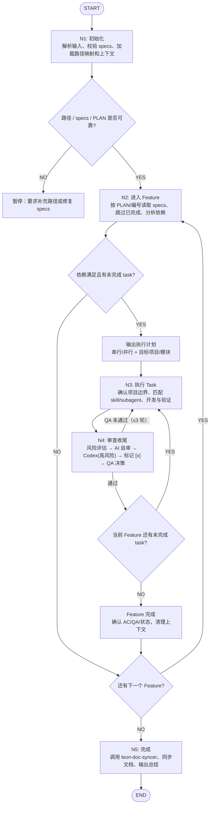

# /leon:ai — 自动开发

根据 `/leon:prd` 生成的 specs 执行自动开发。`/leon:ai` 是总控流程，具体执行细则分散在 `commands/leon-ai-nodes/N*.md`，到达节点前必须读取对应节点文件。

## 输入参数

`$ARGUMENTS` — specs 文件夹路径 + 代码项目路径。

```bash
/leon:ai {SPECS_DIR} 前端{FRONTEND_ROOT} 后端{BACKEND_ROOT}
/leon:ai ~/project/specs 前端~/project/frontend 后端~/project/backend
/leon:ai ~/project/specs 前端~/project/code 后端~/project/BackEndCode
```

> 仅当代码路径能从当前工作目录、specs 相邻目录或 specs 文档中可靠推断时，才允许省略前端/后端路径；否则必须暂停要求补充路径。

## 前置条件

执行前必须确认：

- `{SPECS_DIR}` 存在，且包含 `PLAN.md` 或至少一个编号 feature 目录（如 `1.xxx/`）。
- 每个待执行 feature 目录必须包含 `requirements.md`、`design.md`、`tasks.md`。
- `tasks.md` 中任务必须使用 checkbox 状态：`[ ]` 未完成、`[x]` 已完成；变更任务可带 `[NEW]`、`[CHANGED]`、`[DROPPED]` 标签。
- 如果存在 `PLAN.md`，以 `PLAN.md` 的推荐执行顺序和依赖关系为准；无 `PLAN.md` 时按编号目录升序执行。
- 当前 git working tree 可以是脏的，但执行前必须识别已有改动；不得回滚、覆盖或误归因用户已有改动。
- 代码项目路径、目标前端项目或后端 Maven 模块无法可靠定位时必须暂停确认。

## 项目路径与架构画像

从 `$ARGUMENTS` 解析代码项目路径，建立 `FRONTEND_ROOT`（前端代码根目录）、`BACKEND_ROOT`（后端代码根目录）路径变量。如果未显式传入代码项目路径，只能在当前工作目录、specs 相邻目录或 specs 文档中能明确推断时继续；无法可靠推断时暂停要求用户补充路径，禁止写死某台机器的绝对路径。

前端多项目 / 后端 Maven 多模块的具体架构、技术栈、定位启发和验证命令，统一见架构画像：`~/.claude/commands/leon-ai-nodes/project-profile.md`（N1 时读取，后续节点沿用）。执行时必须先根据 task 涉及的业务域定位具体子项目/模块，再读取该子项目的 manifest、配置、README 和既有代码风格；不要只因为命中了根目录就默认修改所有项目。

## 执行边界

- `/leon:ai` 只执行 specs 中已有 task；不重新解释 PRD、不新增业务需求。
- 如果发现 task 描述缺少关键业务信息、目标模块不明确、依赖 feature 未完成，必须暂停或跳过当前 feature，不能自行脑补。
- 如果发现单个 feature 的未完成任务明显超过 8 个，先按 N2 规则评估拆分；拆分必须保持 feature 闭环、更新 `PLAN.md`，不能只机械按数量切开。
- 每完成一个 task 必须立即执行 N4 审查收尾（风险评估 → 审查 → 标记 `[x]` → QA 决策）；禁止批量开发后统一标记。
- 已完成 `[x]` 和 `[DROPPED]` 任务必须跳过；`[CHANGED]` 任务按更新后描述执行。
- 任何破坏性操作、数据删除、不可逆迁移、权限/支付/认证等高风险不确定项必须暂停确认。

## 流程图

按此流程执行，到达每个节点时读取 `~/.claude/commands/leon-ai-nodes/` 下对应的节点文件获取详细规则。



## 上下文管理（全局规则）

- **task 之间不清理上下文**：连续开发同一 feature 的多个 task 时保持上下文连贯，不做全量重载。
- **feature 完成后**：执行 `/clear`（或在无法真正执行时模拟等效：丢弃非必要长上下文，只保留 N1 路径映射、feature 队列状态、LESSONS 摘要），然后重新读取下一个 feature 的 specs、`{SPECS_DIR}/LESSONS.md`、代码项目的 `.claude/CLAUDE.md` + `.claude/rules/`（无 `.claude/` 时读取目标项目 manifest/config）。
- **task 执行中上下文达 80%**：执行 `/compact` 后继续当前 task；`/compact` 后必须重新确认当前 task 编号、目标项目/模块、已修改文件、尚未完成的验证/审查步骤。
- **任何时候以磁盘上的 tasks.md 为准**，不依赖记忆中的旧任务状态；清理上下文前必须确认 `[x]` 标记已写入。
- 全程自动继续，无需等待用户指令；但如果 N4 输出 QA 暂停、或发现 tasks.md/PLAN.md 状态不一致，必须停止自动继续并要求修复。

## 断点恢复

- 重新运行 `/leon:ai` 时，必须以 `tasks.md` checkbox 为准恢复进度。
- 如果某 task 已改代码但未标 `[x]`，先审查现有变更是否已经完成该 task；完成则补 N4，不要重复开发。
- 如果上次运行留下未提交或未归属改动，先用 diff 判断来源；无法确认时暂停询问。
- `LESSONS.md` 是跨 task 记忆，N1 和每次 feature 级重载都必须读取。

## 全局规则

**节点执行规则（强制）：**

- 每个节点必须按顺序执行，**严禁跳过任何节点**
- 进入每个节点前，必须先读取 `~/.claude/commands/leon-ai-nodes/` 下对应的节点文件
- 每个节点执行完毕后，必须输出确认行，格式：`✓ [节点名] 完成，进入 [下一节点名]`
- 未完成当前节点前，不得进入下一节点

**节点文件映射（每次必须读取）：**

- N1 → `~/.claude/commands/leon-ai-nodes/N1-init.md`
- N2 → `~/.claude/commands/leon-ai-nodes/N2-enter-feature.md`
- N3 → `~/.claude/commands/leon-ai-nodes/N3-execute-task.md`
- N4 → `~/.claude/commands/leon-ai-nodes/N4-review-close.md`
- N5 → `~/.claude/commands/leon-ai-nodes/N5-finish.md`

**暂停：** 业务逻辑歧义、不确定的安全问题、破坏性变更、环境阻塞、路径/模块无法可靠定位、依赖 feature 未完成。
**不暂停：** 纯技术选型 — 在符合 specs 和项目规范的前提下选最优解直接执行。

**执行策略：** AI 自主决策串行或并行（无依赖 + 不同项目 → 并行，否则串行）。并行任务必须有清晰项目/模块边界，且不得同时修改同一文件或共享契约。

## 状态上报（全局规则，可选）

进入每个节点时执行一次状态上报，把当前节点/feature/task 写入 `~/.claude/leon-flow-visualizer/state.json`；写入失败不得阻塞主流程：

```bash
node ~/.claude/leon-flow-visualizer/scripts/update-state.mjs --node {N1..N5} --status running \
  --feature "{feature名}" --featureIndex {F} --featureTotal {总F} \
  --task "{T-编号}: {任务描述}" --taskIndex {N} --taskTotal {总数} \
  --message "{当前动作简述}"
```

- `--feature/--task` 参数按节点实际持有的信息传，N1/N5 可省略
- 暂停时额外上报一次 `--status paused --message "{暂停原因}"`，让可视化界面显示等待态
- N5 输出总结后再上报一次 `--status done`

本地查看：

```bash
node ~/.claude/leon-flow-visualizer/server.mjs
# 打开 http://localhost:5183
```
